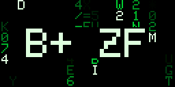

# AnimatedPixelClock

An animated retro-arcade clock on a 128x64 RGB LED matrix, driven by an ESP32-S3.


[](https://youtu.be/dw6Jv9x7Knw)

[](https://youtu.be/dw6Jv9x7Knw)

Fourteen clock styles plus a Cycle All mode (Mario, Space Invaders, Pac-Man, Snake,
Tetris, Asteroids, Dino Runner, Matrix Rain, Weather and more), configurable from a built-in web
interface: per-element sprite
colors, brightness with scheduled night dimming, timezone selection with automatic
DST, and OTA updates.
It can also act as a PC performance monitor, showing live CPU/GPU/RAM/network stats
sent by a desktop companion app.

> Looking for the small OLED version? See the sibling project
> [SmallOLED-PCMonitor](https://github.com/Keralots/SmallOLED-PCMonitor).

## Hardware

| Part | Notes |
|------|-------|
| ESP32-S3 board | ESP32-S3-WROOM-1 (N16R8) devkit or Waveshare ESP32-S3-Zero. Compatible Super Mini boards also work; check that the particular board exposes GPIO 1, 2, 4-14 and 38 without conflicts |
| Alternative: [Waveshare ESP32-S3-RGB-Matrix](https://docs.waveshare.com/ESP32-S3-RGB-Matrix) | Purpose-built HUB75 driver board (ESP32-S3-WROOM-2-N32R16V, 32MB flash, 16MB PSRAM). Carries the HUB75 header and output buffers, so no per-GPIO wiring is needed; ribbon cables and panel power still get connected, per [Waveshare's connection guide](https://docs.waveshare.com/ESP32-S3-RGB-Matrix/Instructions-For-Use). Uses its own pin map - see below |
| 2x [Waveshare P2.5 64x64 HUB75E panels](https://kamami.pl/en/matrix/1183428-waveshare-23708-rgb-full-color-led-matrix-panel-2-5mm-pitch-64x64-pixels-adjustable-brightness-5906623427154.html) | Chained into one 128x64 canvas, 1/32 scan, FM6126A driver (init handled by the firmware) |
| 5V power | Two options - see below |
| Panel joiner (optional) | 3D-printable bracket that locks the two panels into one flat 128x64 frame: [MakerWorld model 3264534](https://makerworld.com/en/models/3264534) |

The tested build runs directly from the ESP32's 3.3V GPIO signals. Keep signal
wires short; the [wiring guide](docs/HUB75_WIRING.md) covers optional buffers if
your panels show flicker or ghosting, plus bench setup and first-light checks.

### Connection diagram


[Download PNG](docs/img/hub75_connection_diagram.png) ·
[Open scalable SVG](docs/img/hub75_connection_diagram.svg)

### Build photos

Photos of the hand-soldered prototype - an ESP32-S3, a USB-C power breakout, the
2200µF capacitor, an XT60 panel feed and the HUB75 header on a piece of protoboard,
wired point to point:

- Board, component side: [boardA.jpg](img/boardA.jpg) · solder side: [boardB.jpg](img/boardB.jpg)
- Board size, about 50 x 41 mm: [board1.jpg](img/board1.jpg) · [board1a.jpg](img/board1a.jpg)
- Connected to the panels: [display1.jpg](img/display1.jpg) · [display2.jpg](img/display2.jpg)

### Powering it

- **Prototype shown above:** a phone charger plugs into a **separate USB-C power
  breakout**. Its 5V/GND rails feed the ESP32's 5V/GND pins and a two-pole panel
  power connector. Each panel gets a dedicated power feed; panel current does
  not pass through the ESP32 or HUB75 ribbon. A **2200µF, 25V capacitor** is
  connected across the 5V/GND rails (positive to 5V). The supply remains **5V**.
  Complete the wiring with power off, then connect the charger.
- **Observed consumption:** the prototype works from a phone charger. The owner
  estimates around **10W** in use and reports measurements staying **below 30W**;
  this is not a measured maximum for sustained full-white content.
- **Bench alternative:** the wiring guide describes a dedicated 5V supply
  (10A example) feeding both panels separately, with the ESP32 powered by USB
  and all grounds connected together.
- **Waveshare ESP32-S3-RGB-Matrix:** the board handles panel power itself. It has
  **two USB-C ports** - one for programming and data, one for power - plus screw-post
  power terminals. Follow [Waveshare's own documentation](https://docs.waveshare.com/ESP32-S3-RGB-Matrix)
  for which input to use; do not guess from the connector shape. The two small wire
  connectors on the board are **not** power inputs: the PH2.0 header is the speaker
  output and the SH1.0 header is the RTC backup battery. Feeding 5V into either will
  damage the board.

### Pin map

Hand-wired boards (WROOM devkit, ESP32-S3-Zero, Super Mini):

| Function | Signals | GPIO |
|----------|---------|------|
| Upper half RGB | R1 / G1 / B1 | 1 / 2 / 4 |
| Lower half RGB | R2 / G2 / B2 | 5 / 6 / 7 |
| Row address | A / B / C / D / E | 8 / 9 / 10 / 11 / 12 |
| Clock / Latch / Output-enable | CLK / LAT / OE | 13 / 14 / 38 |
| Common ground | HUB75E pins 4 and 16 / power ground | GND |

The **E** address line is required for 64x64 (1/32 scan) panels:
**HUB75E pin 8 → GPIO12**, not ground.

Waveshare ESP32-S3-RGB-Matrix (fixed by the board, nothing to wire):

| Function | Signals | GPIO |
|----------|---------|------|
| Upper half RGB | R1 / G1 / B1 | 4 / 5 / 6 |
| Lower half RGB | R2 / G2 / B2 | 7 / 15 / 16 |
| Row address | A / B / C / D / E | 18 / 8 / 3 / 42 / 9 |
| Clock / Latch / Output-enable | CLK / LAT / OE | 41 / 40 / 2 |

[`src/display/hub75_pins.h`](src/display/hub75_pins.h) holds the hand-wired map as
the default and defines the override contract; the Waveshare values are supplied by
the `matrix-waveshare` environment in [`platformio.ini`](platformio.ini). A board
environment overrides the map from `build_flags` by defining `HUB75_PINS_CUSTOM`
plus all 14 pins. A partial override is a compile error, so a half-edited map cannot
reach the panels.

## Clock styles

| ID | Style | Description |
|----|-------|-------------|
| 0 | Mario | Mario jumps to bounce changed digits; optional idle enemy encounters |
| 1 | Standard | Traditional digital clock with date |
| 2 | Large | Extra-large digits |
| 3 | Space Invaders | Shoots lasers to change digits; choose an invader or spaceship character |
| 5 | Pong / Arkanoid | Breakout-style ball physics, digits shatter and reassemble |
| 6 | Pac-Man | Pac-Man eats pellet-based digits |
| 7 | Snake | Nokia-style snake hunts pellets left by changed digits |
| 8 | Tetris | Block digits rebuilt by slabs or falling dots, idle falling blocks with a separate configurable color per shape; optional small corner-clock mode hands the whole panel to an auto-played game with a much taller stack |
| 9 | Cycle All Styles | Choose enabled styles, their order and duration in Clock settings; Weather is skipped until configured |
| 10 | Asteroids | Wireframe ship shoots changed digits into spinning line shards |
| 11 | Dino Runner | A T-Rex runs and jumps cacti; a pterodactyl swaps changed digits |
| 12 | Matrix Rain | Digital rain with fading glyph trails; changed digits decode out of the rain |
| 16 | TRON | Two neon light cycles leave fading trails, avoid walls and crash into sparks; one traces changed digits as a continuous line |
| 15 | Bomberman | Brick digits explode with cross-shaped blasts and rebuild; a tiny hero navigates between digits, bombs crates and collects bonuses |
| 17 | Doom Fire | The PSX Doom fire effect: the digits are heat sources burning white-hot over a fire line, and a changed digit burns away before the new one re-ignites |
| 14 | Weather Clock | Time plus live local weather: animated condition icon, temperature, daily range, humidity, sunrise/sunset |

ID 4 is a legacy alias for the Space Invaders renderer and is not a separate
choice in the web interface. ID 13 is retired; use the IDs listed above.

Style colors are editable in the web interface (digits,
characters, effects, backgrounds), so each clock can match your setup.

The style names describe what each animation is styled after. This project is
not affiliated with or endorsed by the rights holders; see
[Trademarks and attribution](#trademarks-and-attribution).

### Hour change animations

Every animated style rebuilding all four digits at the 09:59 to 10:00 rollover,
shown at twice the panel's pixel size.

<table>
<tr>
<td align="center"><br><b>0</b> Mario</td>
<td align="center"><br><b>3</b> Space Invaders</td>
<td align="center"><br><b>5</b> Pong / Arkanoid</td>
</tr>
<tr>
<td align="center"><br><b>6</b> Pac-Man</td>
<td align="center"><br><b>7</b> Snake</td>
<td align="center"><br><b>8</b> Tetris</td>
</tr>
<tr>
<td align="center"><br><b>10</b> Asteroids</td>
<td align="center"><br><b>11</b> Dino Runner</td>
<td align="center"><br><b>12</b> Matrix Rain</td>
</tr>
<tr>
<td align="center"><br><b>16</b> TRON</td>
<td align="center"><br><b>15</b> Bomberman</td>
<td align="center"><br><b>17</b> Doom Fire</td>
</tr>
</table>

Standard and Large have no change animation, and the Weather clock is not shown
here. All colors above are the defaults.

## Web interface

Once on WiFi, open the device's IP address or `http://pixelclock.local` in a browser:

- **Clock settings**: style, 12/24 hour, date format, position, per-style animation
  options, per-element colors with one-click reset to defaults
- **Display**: brightness (live slider), colon blink mode/rate, adaptive refresh rate,
  scheduled night dimming (start/end time to the minute + dim level) and a scheduled
  power-off window that blanks the panel overnight to spare the LEDs
- **Audio visualizer**: effect style, its colors and the oscilloscope options
- **Timezone**: built-in region list with automatic DST transitions (POSIX TZ rules, no
  manual toggles)
- **Network**: DHCP or static IP, device name (mDNS), show IP at boot, NTP time
  servers (see below)
- **PC monitor layout**: which metrics are visible and where, 5-row / 6-row / large
  text modes, progress bars, drag-and-drop placement on a live preview
- **Config export/import** as JSON (includes the color palette)
- **Firmware update**: upload a `.bin` over the air

### Time servers (NTP)

The clock gets the time over NTP and applies the timezone rules locally. By default it
asks `pool.ntp.org`, then `time.nist.gov`.

The **Network** page has a *Time servers (NTP)* card with a primary and a secondary
field. Either accepts a hostname or an IP, so you can point the clock at a local time
source (a router, a pfSense box, an internal NTP server) instead of the public pool.
Leave the primary blank to fall back to the compiled default; leave the secondary blank
to use no fallback server at all.

**Test** probes each configured server directly and reports whether it answered, with
the UTC time it returned. That check uses its own throwaway socket, so it never
disturbs the running clock. Saving the settings reapplies the timezone and forces a
resync, which can take a few seconds on a slow server.

Both fields are included in config export/import.

## Weather (optional)

The Weather Clock (style 14) shows current conditions next to the time: an animated
icon (sun, clouds, rain, snow, storm...), the temperature, today's high/low, humidity
and sunrise/sunset times. When enabled it also joins the Cycle All rotation as an
extra screen.

Setup (web interface, Clock page, Weather Clock style):

1. Tick **Enable weather updates**.
2. Type your city into **Find your location** and press Search - it fills in the
   coordinates (the lookup runs in your browser; the device only stores latitude and
   longitude). You can also enter coordinates manually.
3. Pick Celsius or Fahrenheit. Save.

Data comes from [Open-Meteo](https://open-meteo.com/) (no account or API key needed),
fetched every 10 minutes. The optional API key field is only for Open-Meteo
commercial subscriptions. Icon, effect and temperature colors are editable in the
style's Colors card like any other clock.

## Ambient screensaver

On the web interface's Display page you can run an **ambient screensaver** instead of
the clock: a Space Invaders battle, a Pac-Man chase, a starfield, an aquarium with
fish, bubbles and kelp, or a burning room where a very calm dog insists everything is
fine. An optional small clock stays in the corner. Press **Start
now** to keep the effect on until you stop it, or enable the schedule to have it come
on automatically during set hours (e.g. 20:00-23:00). `GET /api/mode/ambient` /
`/api/mode/auto` do the same from automations.

### Custom animations (upload your own GIFs)

The **Custom animation** ambient effect plays animations you upload to the device.
How much fits depends on the board: the 4MB layout has 128KiB of animation storage,
so short clips fit best there (an empty tested device allows about 23 frames), the
16MB devkit has 3.4MB, and the 32MB Waveshare driver board has 23MB. The UI
reports the current upload budget, including space needed for a temporary file.

In the desktop companion, save `pixelclock.local` (or your clock's IP) on
**Connection**, then open **Animations**. Refresh storage, select a GIF, choose
crop/pad/stretch and its anchor, and create a preview. Automatic frame skipping
fits the clip to available space while preserving its duration. Upload the result
and use **Play** to try it. To keep it as the ambient effect, select it on the
clock's Display page and save. GIF input is limited to 8MiB; trim large clips first.

Alternatively, convert a GIF with the command-line tool:

```bash
pip install pillow
python tools/gif2pca.py my.gif                        # writes my.pca
python tools/gif2pca.py my.gif --preview check.gif    # eyeball the result first
python tools/gif2pca.py my.gif --upload http://pixelclock.local   # convert + upload
```

The converter fits the GIF to the 128x64 panel (`--fit crop|pad|stretch`, with
`--anchor start|center|end` choosing which edge survives a crop - use `--anchor end`
to keep a caption at the bottom), quantizes all frames to one 16-color palette and
packs them into a compact `.pca` file (4KiB of pixel data per frame, 1.5MiB max, up to 360
frames; use `--frame-skip 2` for long GIFs).

Upload either with `--upload`, with the file picker on the Display page (select the
ambient effect "Custom animation" to see it), or with curl:

```bash
curl -F "anim=@my.pca" "http://pixelclock.local/api/anim/upload"
```

Then pick the animation in the dropdown, **Save**, and **Start now**. Uploaded
animations survive reboots and normal firmware-only OTA updates; replacing or
erasing the filesystem removes them. Manage them with
`GET /api/anim/list` and `GET /api/anim/delete?name=<name>`.

### Custom clock rotation

Select **Custom rotation** (style 9) in Clock settings. Enable the desired styles,
move them with **Up/Down**, and set each duration from 5 to 3600 seconds, then
save. At least one non-weather style must remain enabled. Rotation resumes from
the first available style after another display mode interrupts it. Settings are
included in configuration export/import.

### Device diagnostics

Expand **Diagnostics** under **Device status** in the web portal for firmware,
flash/storage capacity, heap usage, reset reason, time/weather state and animation
errors. **Download diagnostics** saves the same information as JSON, without WiFi
credentials. It is also available at `GET /api/diagnostics`.

## PC monitor mode (optional)

With the companion app running on your PC, the display switches to live hardware
stats (CPU/GPU temps and loads, RAM, disks, fans, network throughput; up to 20
metrics) and returns to the clock when the PC goes offline.

**Companion app v4** (Windows + Linux) lives in
[`PC-Companion-App-v4/`](PC-Companion-App-v4/): a tray app with a
web-style config window, live device preview, drag-and-drop layout editor and
sensor picker.

- **Windows**: download and run
  [`pc_stats_monitor_v4.exe`](https://github.com/Keralots/AnimatedPixelClock/releases/latest/download/pc_stats_monitor_v4.exe),
  no Python needed. Install
  [LibreHardwareMonitor](https://github.com/LibreHardwareMonitor/LibreHardwareMonitor/releases)
  and run it as Administrator for temperature/fan/power sensors (on 0.9.5+ enable
  Options > Remote Web Server > Run).
- **Linux**: `cd PC-Companion-App-v4/linux-companion`, then
  `python3 -m pip install -r requirements.txt` and
  `python3 pc_stats_monitor_v4_linux.py`.

The release includes the Windows companion alongside the firmware. Follow the
[Windows companion instructions](PC-Companion-App-v4/win-companion/README.md)
to run from source or rebuild it.

Metrics are sent as JSON over local UDP (port 4210), at the companion's configured
update interval. Both companions default to 3 seconds. CPU usage depends
on the host, enabled sensors and update interval.

Do not want the stats screen? Untick **Send PC stats to the display** on the
Connection page. The companion stops reading sensors and stops sending packets,
so the device falls back to its clock or scheduled ambient screen. Combined with
the audio visualizer below, that gives a display that is either the equalizer
while music plays or the clock the rest of the time.

## Audio visualizer (optional)

With the companion app streaming your PC's sound, the display becomes a spectrum
analyzer: smooth bars with a green/yellow/red gradient (colors editable),
falling peak dots, and an optional small clock in the corner.

Choose **Visualizer style** in the device web UI's **Display -> Audio visualizer**
card, then **Save settings**:

- **Classic EQ**: the original 32 bars, editable colors and falling peak dots (default).
- **Neon Mirror**: segmented cyan and magenta bars pulse outward from a central
  horizon, with bright peak markers for a synthwave look.
- **Phosphor Waterfall**: a scrolling spectrum history in green, mint and amber,
  inspired by vintage computer displays. Bass is on the left, treble on the right;
  new sound enters at the top and fades downward.
- **Purple LED Stage**: a curved concert light wall. Each column follows its own
  band, bass opens the wave and treble adds pale pink highlights.
- **Starfield Overdrive**: flight through stars whose trails stretch on every
  bass onset.
- **Oscilloscope**: the live waveform on a lab-scope graticule, with a phosphor
  trail behind it. The trace is trigger-aligned on the PC so it stands still
  instead of sliding, and it takes its colors from the same three editable slots
  as Classic EQ (grid from the low color, trace from mid, peaks from the top one).
- **AudioMotion Clone**: 128 independent one-pixel columns mirrored around the
  panel centre, using the Mica rainbow palette. The current Companion supplies
  the 128 columns via `FFT2`; older 32-band `FFT1` senders remain supported.

Classic EQ and the Oscilloscope each have their own color pickers, and the
**Colors and options** card shows the set that belongs to the selected style; the others use fixed palettes. All of them support the small clock and the same companion audio
stream. Style selection survives restarts and is included in settings
export/import; older settings keep Classic EQ by default on a fresh device.

Selecting the Oscilloscope also reveals its own options, all of which default to
the look above:

- **Graticule**: its own color, or switched off for a bare trace (default on).
- **Trace colors**: the trace itself and the color it fades to at full
  deflection (default yellow fading to red).
- **Flat trace color**: drops that fade so the trace is one color (default off).
- **Fill to centre line**: a solid silhouette instead of a bare line (default off).
- **Phosphor trail**: 0 to 4 ghost traces behind the live one. 0 is a single
  sharp line, 4 smears the most (default 3).
- **Vertical gain**: 50 to 200 percent trace height. Above 100 the loud parts
  flatten against the top and bottom edges, like a scope driven too hard
  (default 100).

**Restore oscilloscope defaults on save** puts all of those back, colors
included, without touching any other setting.

The Oscilloscope needs the waveform that the companion app from this release
sends alongside the spectrum. An older companion streams the spectrum only, and
the device then says so on screen instead of drawing a trace; the other styles
keep working with either version.

Turning **Show small clock** off also hides the fixed guide lines in Neon Mirror
and Phosphor Waterfall. Waterfall then uses the full display height, and the
Oscilloscope re-centers its graticule on the full panel.

Setup:

1. On the PC: tick **Audio visualizer stream** on the companion's Connection
   page and save. The Windows executable build bundles the audio dependencies;
   when running from source, install `soundcard` and `numpy` if needed
   (`python -m pip install soundcard numpy`). It captures whatever the PC is
   playing (WASAPI loopback on Windows, PulseAudio monitor on Linux) - no cables,
   no microphone.
2. On the device: **Audio visualizer** page -> **Start visualizer**
   (or `GET /api/mode/viz` from an automation).

The visualizer stays on until you stop it; if the audio stream disappears for 10
seconds the display falls back to automatic display selection: PC stats while
the companion is online, otherwise the scheduled ambient effect or clock. The
visualizer returns automatically when the stream resumes.

### Start it automatically when music plays

Step 2 can be automatic. Under the stream checkbox, tick **Start the visualizer
when music plays** and save. The companion then watches how loud the captured
audio is and switches the display for you:

| Setting | Default | What it does |
|---|---|---|
| Start delay | 3 s | Sound must keep playing this long before the companion calls `/api/mode/viz`. Short sounds (Windows pops, chat notifications) never reach it. |
| Stop delay | 20 s | Quiet for this long calls `/api/mode/auto`, handing the display back to PC stats, ambient or the clock. |
| Sound threshold | -45 dB | Anything quieter counts as silence. Lower it (-55) if quiet music is missed, raise it (-35) if background sounds trigger it. |

Quiet gaps shorter than a second (between tracks, pauses in a song) do not
restart the start delay, and the companion only releases the display if it was
the one that switched it. The Connection page shows the current sound level in
dB, so you can read it while music plays and set the threshold below it.

After a temporary network failure (for example, waking the PC), failed automatic
mode changes are retried until they succeed or a newer mode replaces them. The
stream keeps its last resolved device IP through temporary `.local` lookup failures.
If the clock restarts during playback, automatic mode restores the visualizer
after detecting its new uptime (checked every 10 seconds).

## Flashing

### Web flasher (recommended)

Open **[pixelclock.stolaris.dev](https://pixelclock.stolaris.dev)** in Chrome or Edge
on a desktop, pick your board, plug it in over USB and press Install. It flashes a
prebuilt firmware image straight from the browser, then walks you through joining
WiFi and connecting the PC companion. Nothing to install, no PlatformIO, no drivers
beyond the ones your OS already ships.

Board choices on that page:

- **ESP32-S3-Zero / Super Mini (4MB)** - the compact build. Native USB: if the serial
  port never appears, hold BOOT while plugging the board in.
- **ESP32-S3-WROOM devkit (16MB)** - the full-size devkit; its larger flash also
  provides more space for custom animations.
- **Waveshare ESP32-S3-RGB-Matrix** - the purpose-built driver board. Native USB,
  same BOOT-hold trick if the port does not appear. Its 32MB flash leaves 23MB
  for custom animations.

The same page has a serial log viewer, useful if the display stays dark after a flash.
It also provides a direct Windows companion download after flashing. Full images,
OTA-only images for every board, the EXE and SHA-256 checksums are available in
[GitHub Releases](https://github.com/Keralots/AnimatedPixelClock/releases/latest).
Release packaging is documented in [docs/firmware/README.md](docs/firmware/README.md).

### Building from source

Built with [PlatformIO](https://platformio.org/).

```bash
# ESP32-S3-WROOM devkit (default, 16MB)
pio run -e matrix-s3-wroom -t upload

# Compact 4MB boards (ESP32-S3 Super Mini, Waveshare ESP32-S3-Zero)
pio run -e matrix-s3 -t upload

# Waveshare ESP32-S3-RGB-Matrix driver board
pio run -e matrix-waveshare -t upload
```

Omit `-t upload` to build only. The WROOM environment currently sets upload and
monitor ports to `COM9`; change them in [`platformio.ini`](platformio.ini) or
override the upload port with `--upload-port <port>` for your computer.

The compact 4MB boards use native USB (no separate USB-UART chip): if the first
flash isn't detected, hold BOOT while plugging in USB, then use OTA for later
updates.

The Waveshare driver board also uses native USB, and its UART0 pins are reused for
the onboard audio and SD card, so the firmware console is USB CDC. Its module has
octal flash, which the `matrix-waveshare` environment selects with
`board_build.arduino.memory_type = opi_opi`; the image is written with a 32MB flash
header, and `large_littlefs_32MB.csv` splits the part into two 4.5MB OTA slots and
23MB of animation storage.

The `matrix-s3-bringup` / `matrix-wroom-bringup` / `matrix-waveshare-bringup`
environments build a standalone panel self-test (`bringup/hello_matrix.cpp`) with six
test patterns, useful for verifying wiring before flashing the full firmware.

### First-time WiFi setup

With no saved WiFi credentials, the device opens an access point named
**PixelClock-Setup** (passwordless by default). Join it
and a captive portal (or `192.168.4.1`) lets you enter your WiFi credentials.
Improv-Serial provisioning over USB is also supported, which is what the web
flasher uses to hand over your network right after installing.

### OTA updates

After the initial flash, update over WiFi from the web interface's Firmware Update
section, or from the command line:

```bash
curl -F "firmware=@.pio/build/matrix-s3-wroom/firmware.bin" http://<device-ip>/update
```

Updating from a [GitHub release](https://github.com/Keralots/AnimatedPixelClock/releases/latest):
upload `OTA_ONLY_firmware-v<version>-<board>.bin`. Do not upload the full
`firmware-v<version>-<board>.bin` - that one carries the bootloader and partition
table and belongs at `0x0` over USB. `wroom` is the ESP32-S3-WROOM-1 N16R8 (16MB)
build, `supermini` the ESP32-S3-Zero / Super Mini (4MB) build, and `waveshare` the
Waveshare ESP32-S3-RGB-Matrix build. Downloads can be verified against
`SHA256SUMS.txt`.

## HTTP control API

Simple GET endpoints for home automation (Home Assistant, Node-RED, cron + curl).
These controls do not save settings themselves. Mode/display overrides reset on
reboot; brightness and style changes update the in-memory settings and can be
persisted by a later settings save. No authentication, so keep
the device on a trusted LAN.

| Endpoint | Description |
|----------|-------------|
| `/api/status` | Current display/mode state as JSON |
| `/api/display/off` / `/api/display/on` | Blank / restore the panel |
| `/api/display/brightness?value=0-100` | Set brightness (percent) |
| `/api/mode/clock` / `/api/mode/auto` | Force the clock / resume automatic mode |
| `/api/mode/ambient` | Force the ambient screensaver on now |
| `/api/mode/viz` | Force the audio spectrum visualizer (needs the companion streaming) |
| `/api/clock/style?id=<id>` | Switch the clock style; use an ID from the table above (13 is retired) |
| `/api/ntptest?server=<host>` | Probe an NTP server and report whether it answers |
| `/api/reboot` | Soft-restart (settings kept) |

```bash
curl http://pixelclock.local/api/display/off
curl "http://pixelclock.local/api/display/brightness?value=30"
curl "http://pixelclock.local/api/clock/style?id=8"
```

Home Assistant example:

```yaml
rest_command:
  clock_display_off:
    url: "http://pixelclock.local/api/display/off"
  clock_display_on:
    url: "http://pixelclock.local/api/display/on"
```

## Notifications API

Push a message banner onto the display from anything that can send an HTTP request.
The banner appears over the active screen (including ambient effects and the
visualizer), scrolls if the
text is too long, and disappears on its own.

```bash
curl -X POST http://pixelclock.local/api/notify \
  -H "Content-Type: application/json" \
  -d '{"text":"Doorbell!","icon":"bell","color":"#FFAA00","duration":8000}'
```

| Field | Required | Description |
|-------|----------|-------------|
| `text` | yes | Message, up to 200 bytes (200 ASCII characters) |
| `color` | no | Banner color as `#RRGGBB` (default white) |
| `icon` | no | One of `bell`, `mail`, `alert`, `heart`, `check`, `cross`, `info`, `home`, `music`, `star` |
| `duration` | no | Display time in ms, 1000-60000 (default 5000) |
| `position` | no | `top` or `bottom` (default: the position set in the web interface) |

`GET /api/notify/dismiss` clears the banner early. A new POST replaces the current
banner. The feature can be disabled entirely on the web interface's Display page
(Notifications card), where the default banner position is also set.

Home Assistant example:

```yaml
rest_command:
  clock_notify:
    url: "http://pixelclock.local/api/notify"
    method: POST
    content_type: "application/json"
    payload: '{"text":"{{ message }}","icon":"{{ icon | default(''info'') }}","color":"{{ color | default(''#FFFFFF'') }}"}'
```

## Libraries

- [ESP32-HUB75-MatrixPanel-DMA](https://github.com/mrcodetastic/ESP32-HUB75-MatrixPanel-I2S-DMA) (matrix driver)
- Adafruit GFX, WiFiManager (tzapu), ArduinoJson, Improv-Serial

## License

Licensed under the [MIT License](LICENSE).

## Trademarks and attribution

AnimatedPixelClock is an independent, non-commercial hobby project. It is not
affiliated with, endorsed by, sponsored by or connected to Nintendo, The Tetris
Company, Bandai Namco, Taito, Atari, Konami or any other rights holder.

The clock and ambient style names describe what each animation is styled after,
so that you can tell the styles apart. Every sprite and effect in this firmware
is drawn procedurally from the source in this repository, with user-configurable
colors. No game artwork, sprite sheets, tile data, ROM data, fonts, sounds or
music from any commercial game are copied, bundled or distributed here, and the
firmware does not emulate or reproduce any of those games.

All product names, game titles, logos and brands referenced in this project are
the property of their respective owners. They are used here only to describe the
visual style of an animation, and their use does not imply any endorsement,
sponsorship or affiliation.
